# Neo4j Music Recommendation System

## Descrição do Projeto
Este projeto foi desenvolvido como parte de um desafio prático da DIO com foco em **modelagem de banco de dados em grafos com Neo4j**.

A proposta consiste em simular um **sistema de recomendação de músicas**, conectando usuários, músicas, artistas e gêneros em um grafo. A partir dessas relações, é possível identificar padrões de consumo, preferências musicais e gerar recomendações com base no comportamento dos usuários.

O projeto foi estruturado para demonstrar, na prática, como bancos de dados em grafos são especialmente úteis em cenários onde **as conexões entre os dados são tão importantes quanto os próprios dados**.

---

## Contexto do Problema
Plataformas de música e streaming trabalham intensamente com relacionamentos:
- usuários ouvem músicas;
- usuários curtem músicas;
- usuários seguem artistas;
- músicas pertencem a gêneros;
- músicas são performadas por artistas.

Em um cenário como esse, um banco relacional exigiria várias tabelas intermediárias e múltiplas junções para responder perguntas relativamente simples. Com Neo4j, essas conexões são representadas diretamente por relacionamentos, o que torna a modelagem mais intuitiva e as consultas mais naturais.

---

## Justificativa do Uso de Grafos
O uso de grafos foi escolhido porque o problema envolve **relacionamentos ricos e interdependentes**. Em sistemas de recomendação, não basta armazenar dados isolados: é preciso compreender como usuários, músicas e artistas se conectam.

Com esse modelo, o grafo consegue responder perguntas como:
- Quais músicas são mais ouvidas?
- Quais músicas recebem mais curtidas?
- Quais artistas têm mais seguidores?
- Quais músicas pertencem a determinados gêneros?
- Quais músicas podem ser recomendadas a um usuário com base nos artistas que ele segue?

---

## Modelo do Grafo

### Nós
- `User {userId, name, country}`
- `Song {songId, title, duration}`
- `Artist {artistId, name}`
- `Genre {genreId, name}`

### Relacionamentos
- `(User)-[:LISTENED_TO {playCount, lastPlayedAt}]->(Song)`
- `(User)-[:LIKED {likedAt}]->(Song)`
- `(User)-[:FOLLOWS]->(Artist)`
- `(Song)-[:PERFORMED_BY]->(Artist)`
- `(Song)-[:IN_GENRE]->(Genre)`

### Representação visual do modelo
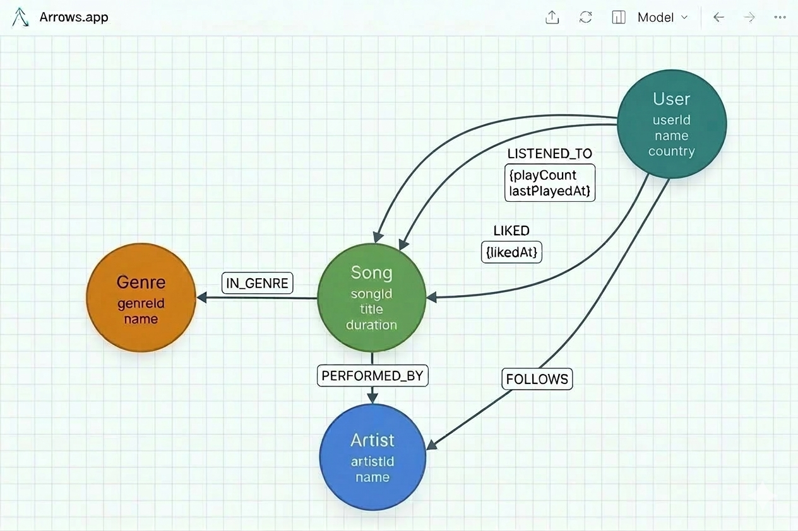

---

## Estrutura do Repositório

```bash
neo4j-music-recommendation-system/
├── README.md
├── dataset/
├── scripts/
└── images/
```
---

## Organização das pastas

- `dataset/`: arquivos CSV utilizados como base estrutural dos dados do projeto;
- `scripts/`: scripts Cypher para criação de constraints, carga de nós, relacionamentos e consultas;
- `images/`: prints do modelo, visualizações e resultados das consultas;
- `README.md`: documentação principal do projeto.

---

## Dataset
O repositório contém arquivos CSV com a estrutura dos dados utilizados no projeto, incluindo:

- usuários;
- músicas;
- artistas;
- gêneros;
- músicas ouvidas;
- músicas curtidas;
- artistas seguidos;
- associação entre músicas e artistas;
- associação entre músicas e gêneros.

Os arquivos CSV foram mantidos no projeto como dataset de apoio e documentação da estrutura dos dados. A execução no Neo4j Aura foi feita por meio de scripts Cypher adaptados para o ambiente.

---

## Scripts do Projeto

### `01-constraints.cypher`
Cria restrições de unicidade para os identificadores principais dos nós:

- `User.userId`
- `Song.songId`
- `Artist.artistId`
- `Genre.genreId`

### `02-carga-nos.cypher`
Responsável pela criação dos nós principais:

- usuários;
- músicas;
- artistas;
- gêneros.

### `03-carga-relacionamentos.cypher`
Cria os relacionamentos do grafo:

- músicas ouvidas pelos usuários;
- músicas curtidas;
- artistas seguidos;
- vínculo entre músicas e artistas;
- vínculo entre músicas e gêneros.

### `04-consultas-negocio.cypher`
Contém consultas utilizadas para explorar o grafo e demonstrar seu uso em cenários de recomendação musical.

---

## Resultados do Projeto

Após a execução dos scripts, o grafo foi estruturado com:

- **31 nós**
- **61 relacionamentos**
- **4 tipos de nós**
- **5 tipos de relacionamentos**

### Resumo da estrutura carregada
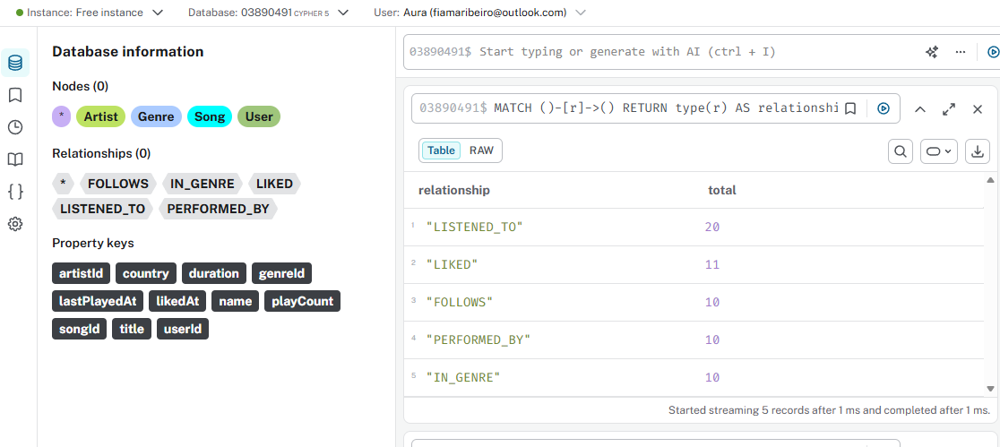
---

## Consultas de Negócio

### 1. Quais são as músicas mais ouvidas?
Consulta que soma a quantidade total de reproduções por música, permitindo identificar os conteúdos com maior volume de escuta na base.

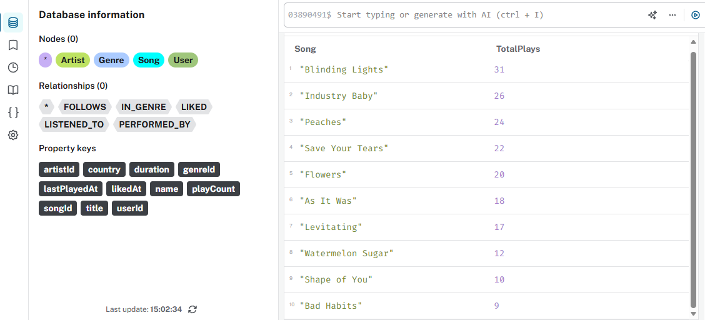

### 2. Quais são as músicas mais curtidas?
Consulta que mostra quais músicas receberam mais interações positivas dos usuários, ajudando a identificar preferências explícitas.

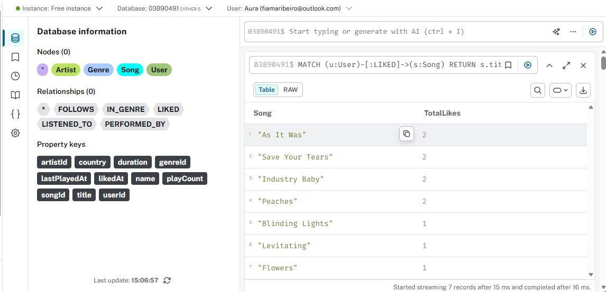

### 3. Quais artistas possuem mais seguidores?
Consulta que evidencia os artistas com maior número de seguidores no grafo, permitindo observar quais nomes possuem maior alcance entre os usuários.

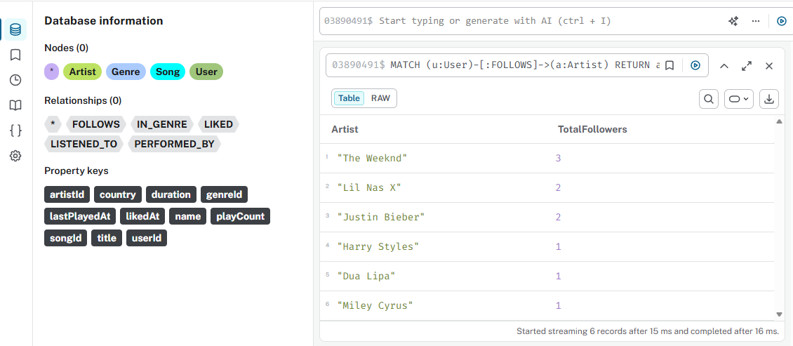

### 4. Como as músicas estão distribuídas por gênero?
Consulta que agrupa as músicas por gênero, facilitando a visualização da organização do catálogo e das categorias representadas no projeto.

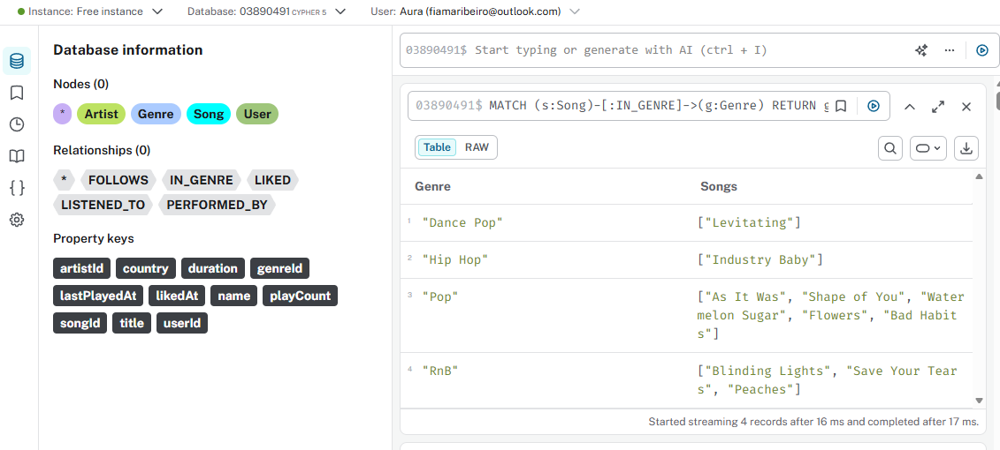

### 5. Quais músicas podem ser recomendadas com base nos artistas seguidos?
Consulta que sugere músicas a partir dos artistas que cada usuário segue, demonstrando uma lógica básica de recomendação orientada por relacionamento.

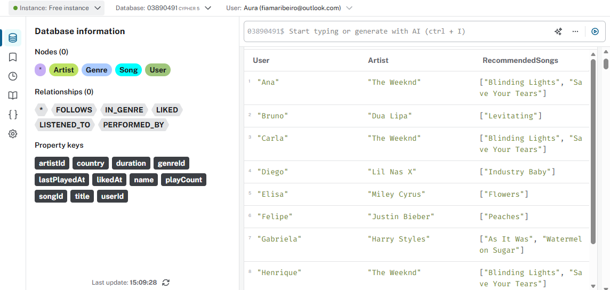

### 6. Visualização geral do grafo populado
Visualização do grafo completo após a carga dos nós e relacionamentos, demonstrando a estrutura conectada do sistema de recomendação musical.

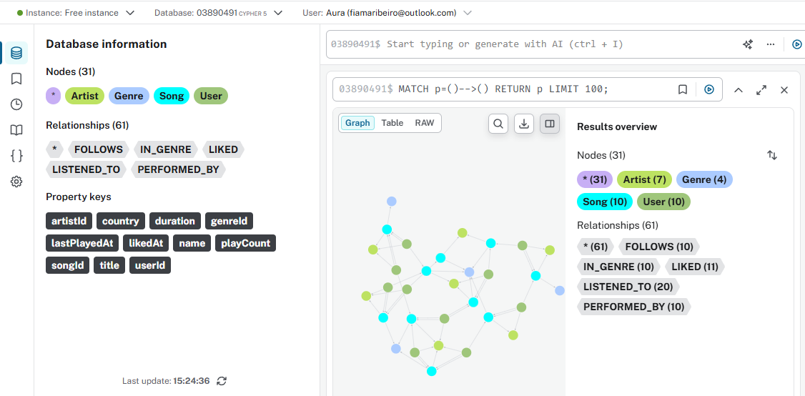

---

## Evidências Extras

Além das consultas principais, o projeto também conta com evidências complementares que reforçam a consistência técnica da modelagem e da carga de dados realizada.

### Total de nós carregados
Consulta de validação utilizada para confirmar a quantidade total de nós criados no grafo após a execução da carga inicial.

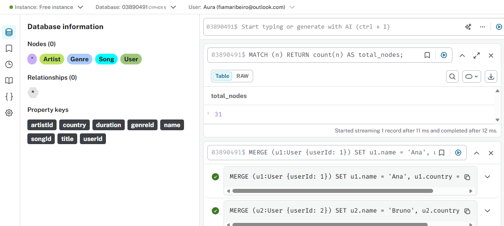

### Músicas e respectivos artistas
Consulta que relaciona cada música ao artista responsável por sua performance, demonstrando a integridade do relacionamento `PERFORMED_BY`.

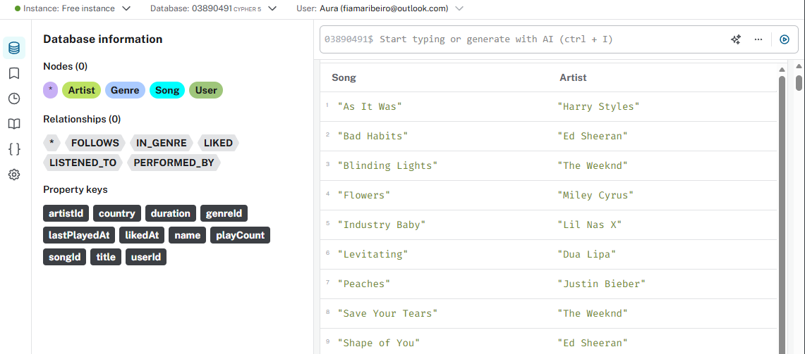

### Usuários agrupados por artistas de músicas curtidas
Consulta que identifica quais usuários curtiram músicas de determinados artistas, permitindo observar afinidades e agrupamentos de preferência musical.


### Constraints criadas
Evidência da criação das constraints de unicidade utilizadas para garantir integridade dos identificadores principais no grafo.

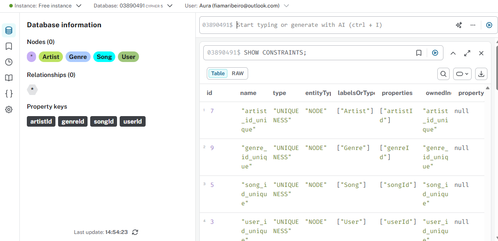
---

## Como Executar

### Ambiente utilizado
A implementação deste projeto foi realizada no **Neo4j Aura**, utilizando o editor de consultas da plataforma para criação da estrutura, carga dos dados e execução das consultas de negócio.

### Etapas de execução
Para reproduzir o projeto, siga a sequência abaixo:

1. Crie ou inicie uma instância no **Neo4j Aura**;
2. Execute o script `01-constraints.cypher` para criar as restrições de unicidade;
3. Execute o script `02-carga-nos.cypher` para inserir os nós principais do grafo;
4. Execute o script `03-carga-relacionamentos.cypher` para criar os relacionamentos entre usuários, músicas, artistas e gêneros;
5. Execute o script `04-consultas-negocio.cypher` para explorar os dados e validar os cenários de recomendação;
6. Analise os resultados diretamente no ambiente de consultas do Neo4j.

### Observação
Embora o repositório contenha arquivos CSV como base estrutural dos dados, a carga final foi adaptada para execução direta em **Cypher**, garantindo melhor compatibilidade com o ambiente **Neo4j Aura**.

---

## Dificuldades Encontradas

Durante o desenvolvimento do projeto, alguns pontos exigiram maior atenção:

- definição inicial da modelagem do grafo de forma clara e coerente com o objetivo de recomendação musical;
- organização visual dos relacionamentos no modelo conceitual, para evitar ambiguidades na leitura;
- adaptação do processo de carga de dados ao funcionamento do **Neo4j Aura**;
- validação da consistência entre os dados planejados, os scripts executados e os resultados obtidos;
- cuidado na geração das evidências visuais, garantindo que os prints refletissem corretamente a base final carregada.

---

## Soluções Aplicadas

Para lidar com esses desafios, foram adotadas as seguintes estratégias:

- construção prévia do modelo conceitual no **Arrows.app**, permitindo validar a estrutura antes da execução;
- uso de **constraints** para garantir unicidade e evitar duplicidade de registros;
- manutenção dos arquivos CSV no repositório como apoio documental da estrutura dos dados;
- adaptação da carga para scripts **Cypher** executados diretamente no Aura;
- execução de queries de conferência para validar a quantidade de nós, relacionamentos e a consistência geral do grafo.

---

## Conclusão

Este projeto permitiu aplicar, de forma prática, conceitos essenciais de **banco de dados em grafos com Neo4j**, mostrando como um modelo orientado a relacionamentos pode ser utilizado em cenários de recomendação musical.

Além de trabalhar modelagem e consultas em **Cypher**, o desafio também reforçou a importância de documentar bem um projeto técnico, estruturando o repositório com clareza, consistência e valor de portfólio.

O resultado final é um projeto enxuto, mas sólido, que demonstra como grafos podem apoiar sistemas de recomendação de maneira intuitiva, conectada e escalável.

---

## Tecnologias Utilizadas

- **Neo4j Aura**
- **Cypher**
- **Arrows.app**
- **GitHub**

---

## Autor

Projeto desenvolvido por **Fiama Ribeiro** como parte do desafio prático da DIO sobre modelagem de banco de dados em grafos com Neo4j.
